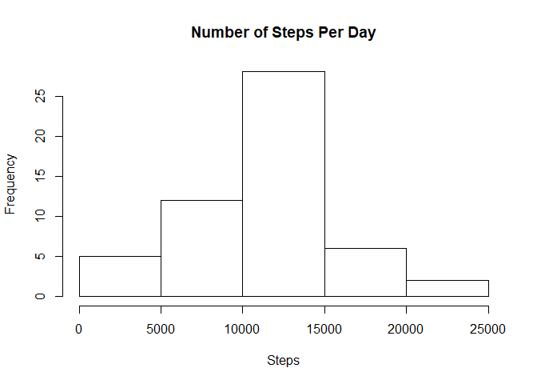
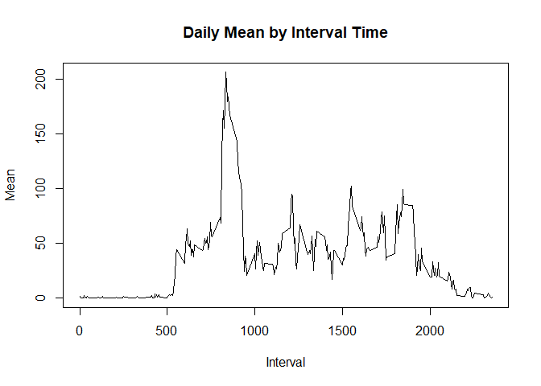
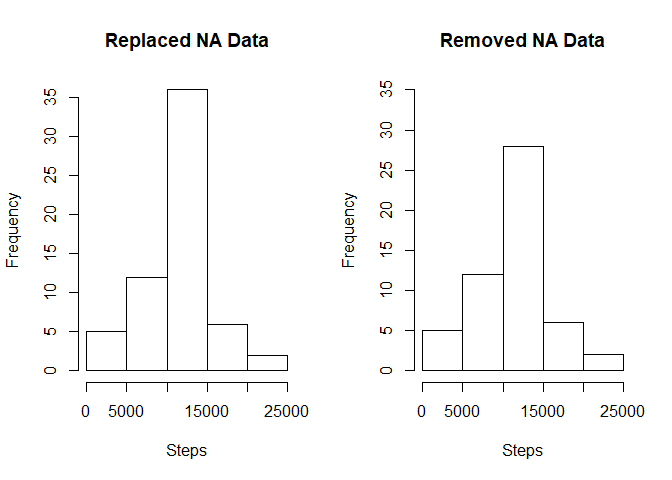
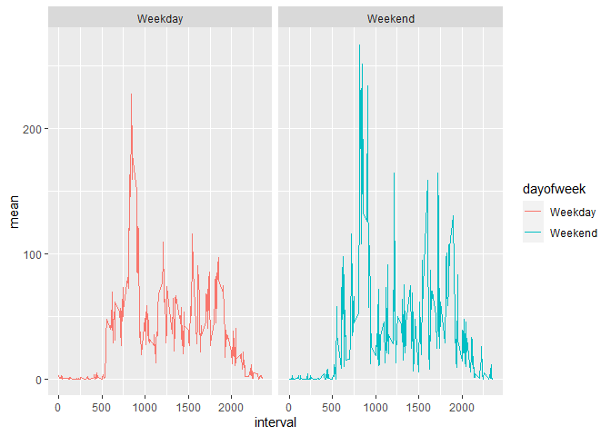

```r
knitr::opts_chunk$set(echo = TRUE)
```

### Loading and preprocessing the data

Packages needed: plyr, dplyr, and ggplots2
Data is read from the activity.csv file and NAs taken out.

```r
library(dplyr)
```

```
## Warning: package 'dplyr' was built under R version 3.4.4
```

```
## 
## Attaching package: 'dplyr'
```

```
## The following objects are masked from 'package:stats':
## 
##     filter, lag
```

```
## The following objects are masked from 'package:base':
## 
##     intersect, setdiff, setequal, union
```

```r
library(plyr)
```

```
## Warning: package 'plyr' was built under R version 3.4.4
```

```
## ------------------------------------------------------------------------------
```

```
## You have loaded plyr after dplyr - this is likely to cause problems.
## If you need functions from both plyr and dplyr, please load plyr first, then dplyr:
## library(plyr); library(dplyr)
```

```
## ------------------------------------------------------------------------------
```

```
## 
## Attaching package: 'plyr'
```

```
## The following objects are masked from 'package:dplyr':
## 
##     arrange, count, desc, failwith, id, mutate, rename, summarise,
##     summarize
```

```r
library(ggplot2)


data <- read.csv("./activity.csv")

cleandata <- data[!is.na(data$steps),]
```

### What is mean total number of steps taken per day?

Summary table of steps by date

```r
datasummary <- ddply(cleandata, .(date), summarize, 
                     sum = sum(steps),
                     mean = mean(steps),
                     median = median(steps) 
                     )
```

Histogram Plot of Number of Steps Per Day

```r
hist(datasummary$sum, 
     main = "Number of Steps Per Day",
     xlab = "Steps"
)
```

<!-- -->

Calculate and report the mean and median of the total number of steps taken per day


```r
intervalmean <- ddply(cleandata, .(interval), summarize, 
                      mean = mean(steps))
```

### What is the average daily activity pattern?

Time series plot of intervals and days

```r
plot(intervalmean$interval, intervalmean$mean, 
     type = "l", xlab = "Interval", ylab = "Mean", 
     main = "Daily Mean by Interval Time")
```

<!-- -->

Which interval averages the highest step count?

```r
intervalmean[which.max(intervalmean$mean),]
```

```
##     interval     mean
## 104      835 206.1698
```

### Imputing missing values

Calculate and report the total number of missing values in the dataset 

```r
count(data$steps == "NA")
```

```
##       x  freq
## 1 FALSE 15264
## 2    NA  2304
```

To handle the NA withough taking them out completely, the mean of the interval has replaced the NA cell.

```r
replaceNA <- read.csv("./activity.csv")
replaceNA[is.na(replaceNA)] = "NA"

for(row in 1:nrow(replaceNA)){
  x <- replaceNA[row,3]
  if(replaceNA[row, 1] == "NA"){
    replaceNA[row,1] <- intervalmean[intervalmean[,1]== x,2]
  } 
}
```

Summary table of data with NA replaced with means of intervals

```r
replaceNA[,1] <- as.numeric(replaceNA[,1])

NAdatasummary <- ddply(replaceNA, .(date), summarize, 
                       sum = sum(steps),
                       mean = mean(steps),
                       median = median(steps))
```

Side-by-side histograms of mean steps per day.

Adding the NA values increases the the highest bin (10,000-15,000 steps) in the histogram

```r
par(mfrow = c(1,2))
hist(NAdatasummary$sum, 
     main = "Replaced NA Data",
     xlab = "Steps"
)

hist(datasummary$sum, 
     main = "Removed NA Data",
     xlab = "Steps",
     ylim = c(0,35)
)
```

<!-- -->

### Are there differences in activity patterns between weekdays and weekends?

New data frame with weekdays as a factor using the table where NAs were replaced with mean of the interval

```r
replaceNA$date <- as.Date(NAdatasummary$date, format= "%Y-%m-%d")

weekendDF <- replaceNA %>%
  mutate(dayofweek = weekdays(date))

weekendDF$dayofweek[weekendDF$dayofweek == "Saturday"] <- "Weekend"
weekendDF$dayofweek[weekendDF$dayofweek == "Sunday"] <- "Weekend"
weekendDF$dayofweek[weekendDF$dayofweek == "Monday"] <- "Weekday"
weekendDF$dayofweek[weekendDF$dayofweek == "Tuesday"] <- "Weekday"
weekendDF$dayofweek[weekendDF$dayofweek == "Wednesday"] <- "Weekday"
weekendDF$dayofweek[weekendDF$dayofweek == "Thursday"] <- "Weekday"
weekendDF$dayofweek[weekendDF$dayofweek == "Friday"] <- "Weekday"

weekendDF$dayofweek <- as.factor(weekendDF$dayofweek)

summaryweekend <- ddply(weekendDF, .(dayofweek, interval), summarize, 
                           mean = mean(steps))
```

Plot steps for Weekends and Weekdays by intervals

```r
qplot(data = summaryweekend, facets = .~dayofweek, x = interval, y = mean, 
      geom = "line", col = dayofweek)
```

<!-- -->
